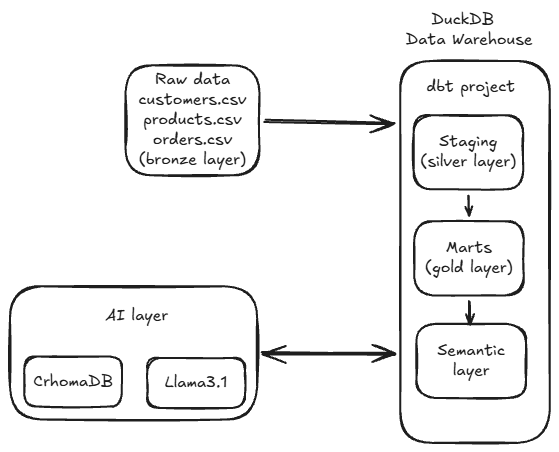
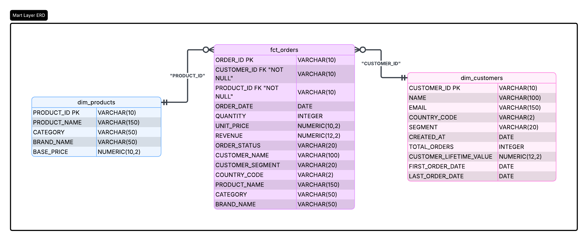

# SQL-Query-Agent

Ask an e-commerce business question in plain English, get an answer back from a
warehouse you can trust.

This is a learning project built to explore **dbt** (data build tool) and the
three-layer data architecture (raw → staging → marts), and then to bolt a
**local, offline text-to-SQL agent** on top of the curated gold layer. Nothing
here calls a cloud API: the warehouse is a single DuckDB file and the LLM runs
through Ollama on your own machine.



---

## How it works

The pipeline has five stages, each one a small script or a dbt command:

| # | Stage | What it does | Entry point |
|---|-------|--------------|-------------|
| 1 | **Generate** | Creates synthetic CSVs for a small e-commerce business, with deliberate data-quality problems baked into the orders file | `data/raw/generate_dataset.py` |
| 2 | **Ingest** | Loads the raw CSVs into a DuckDB database under a `raw` schema | `setup/ingest.py` |
| 3 | **Transform** | dbt models clean the raw data (staging / silver) and reshape it into a star schema (marts / gold) | `dbt run` |
| 4 | **Test** | dbt data tests check uniqueness, non-null keys, referential integrity and accepted values | `dbt test` |
| 5 | **Ask** | Vanna trains a local RAG store on the mart DDL + semantic layer, then translates questions to SQL and runs them | `ai_layer/setup.py`, then the CLI or Streamlit app |

### The data model

Three layers live in one DuckDB file (`data/warehouse/warehouse.duckdb`):

- **`raw`** — CSVs loaded verbatim, every column a string.
- **`main_staging`** — one cleaned view per source (`stg_orders`, `stg_customers`,
  `stg_products`). `stg_orders` is where the mess gets fixed: mixed date formats
  are standardised, rows with a null `customer_id` are dropped, duplicate
  `order_id` rows are deduplicated (keeping the most recent), and non-positive
  quantities are filtered out.
- **`main_marts`** — the gold layer, a star schema:
  - `fct_orders` — one row per order, with `REVENUE` pre-computed and customer /
    product attributes denormalised in so most questions need no joins.
  - `dim_customers` — one row per customer, enriched with lifetime value, order
    count, and first / last order dates.
  - `dim_products` — one row per product.



### The semantic layer

`dbt_project/semantic/semantic_layer.yml` is a hand-written description of the
gold layer — the models, the metrics (`total_revenue`, `order_count`,
`avg_order_value`, `return_rate`, …) and the dimensions (`order_date`,
`product_category`, `country`, …) that are available for questions. It is not a
dbt-native construct; it exists so the AI layer has curated, business-level
context to train on instead of guessing from raw column names.
`dbt_project/analyses/validate_semantic_layer.sql` holds queries that sanity-check
those metrics and dimensions against real data.

### The AI layer

`ai_layer/` uses [Vanna](https://vanna.ai/) with a **ChromaDB** vector store and
**Ollama** (`llama3.1`) as the LLM. `setup.py` trains the store once on:

- the `CREATE TABLE` DDL of each mart table,
- the model / metric / dimension docs from the semantic layer,
- a handful of example question → SQL pairs.

After training, `generate_sql()` retrieves the relevant context for a question
and asks the local model to write the query, which is then run against DuckDB.

---

## Getting started

### Prerequisites

- Python 3.12 (see `.python-version`); 3.10+ works.
- [uv](https://docs.astral.sh/uv/) for dependency management (recommended).
- [Ollama](https://ollama.com/) running locally with the `llama3.1` model pulled:
  ```bash
  ollama pull llama3.1
  ```

### Install

```bash
uv venv
uv pip install -r requirements.txt
```

### Run the pipeline

```bash
# 1. generate the synthetic CSVs
python data/raw/generate_dataset.py

# 2. load them into DuckDB (raw schema)
python setup/ingest.py

# 3. build + test the dbt models
cd dbt_project
dbt run
dbt test
cd ..

# 4. train the local RAG store
python ai_layer/setup.py
```

### Ask questions

Command line:

```bash
python ai_layer/query_engine.py
# Ask a question: What is total revenue by product category?
```

Streamlit UI:

```bash
streamlit run frontend/mvp.py
```

Example questions the agent handles well:

- What is total revenue by product category?
- Who are the top 5 customers by lifetime value?
- How many orders were placed per country?
- What is total revenue for completed orders only?
- How many orders were placed in the last 6 months?

---

## Repository layout

```
data/raw/generate_dataset.py   synthetic dataset generator
setup/ingest.py                CSV -> DuckDB raw schema
dbt_project/
  models/staging/              silver layer: cleaned views + source defs + tests
  models/marts/                gold layer: fct_orders, dim_customers, dim_products
  semantic/semantic_layer.yml  business description of the gold layer
  analyses/                    semantic-layer validation queries
  profiles.yml                 DuckDB target (checked in, no secrets)
ai_layer/
  setup.py                     trains Vanna (ChromaDB + Ollama) once
  query_engine.py              CLI: question -> SQL -> result
frontend/mvp.py                Streamlit interface
docs/                          ERD, gold-layer DDL, star-schema vs 3NF notes
```

Generated artefacts — the CSVs, the DuckDB file, the dbt `target/`, and the
Vanna store — are git-ignored and recreated by the steps above.

## Tech stack

DuckDB · dbt-core + dbt-duckdb · Vanna · ChromaDB · Ollama (llama3.1) ·
Streamlit · pandas
